

  <h3 align="center">Jobly</h3>
  

    A React and Mongo marketplace aiming to connect companies and professionals in the tech world.
     
     
    <a href="https://google.es">View Demo</a>

## Intro

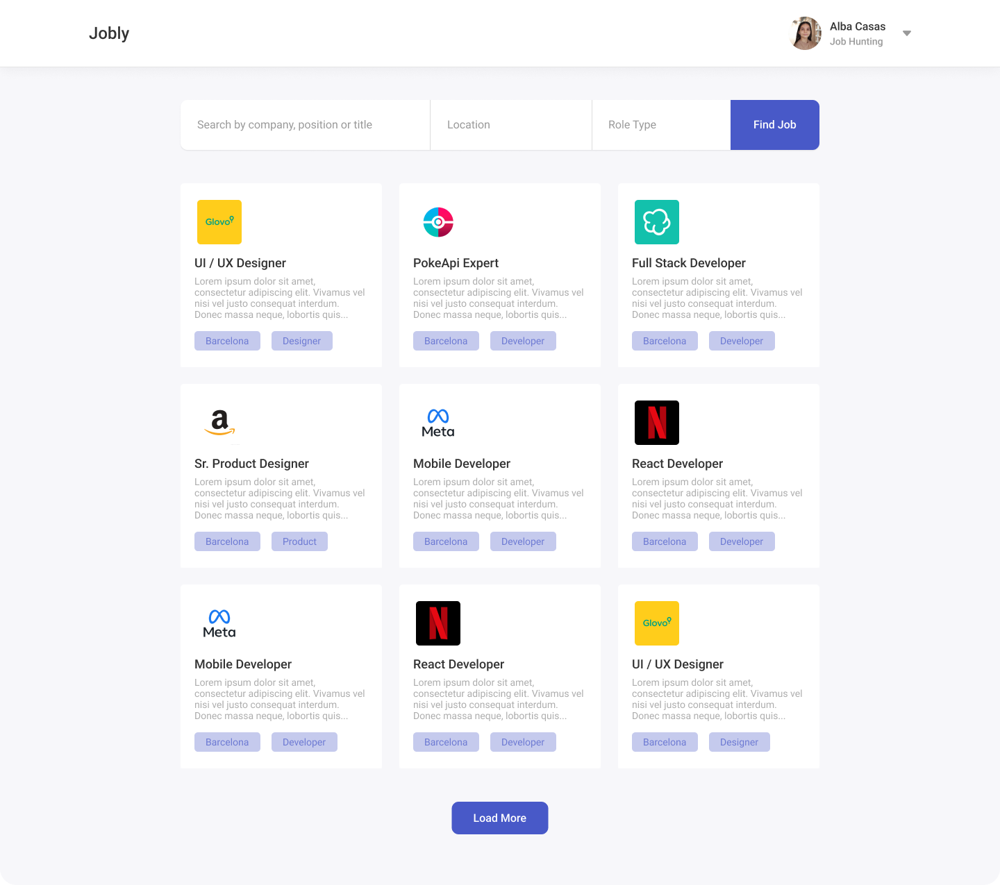

---

Jobly is a fullstack project in where I aim to prove my React and Mongo skills in solving complex real world use cases.

Jobly is a job marketplace where candidates can register and apply for jobs, as well as add their resume and edit their profile.

Companies on the other hand can register and create job postings for candidates. Companies can see their the job postings and candidatures in a different feed.

## Functional Description

#### Candidate

- The candidate may be able to register and log in
- The candidate may view company job postings in a feed
- The candidate can search by title or company
- The candidate will be able to filter requirements (location, position)
- The candidate will be able to edit his profile and password.
- The candidate can apply for an job posting.
- The candidate can send his resume to the job postings in the applying process
- The candidate will be able to delete his account

#### Bussiness

- A company may register and log in
- A company will be able to edit his profile and password.
- A company can be able to view job postings
- A company can add job postings in its "Companies" section.
- A company can be able to see how many candidates have applied to its job posting.
- A company can be able to see its job postings
- A company can be able to see the candidates' profile who have applied to its job posting.
- A company will be able to delete his account
- A company will be able to update its job

---

### Use Cases

##### Candidate

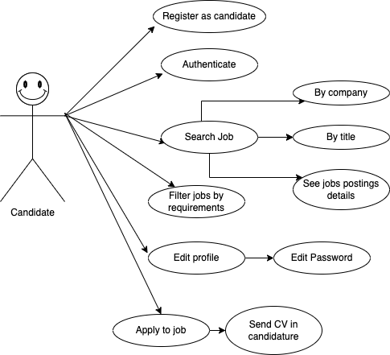

---

#### Company

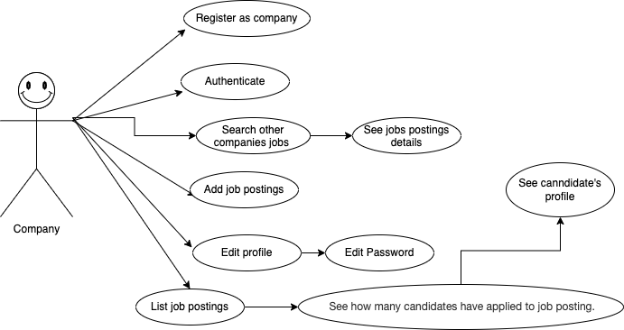

#### User Interface (UI)

##### Main Views

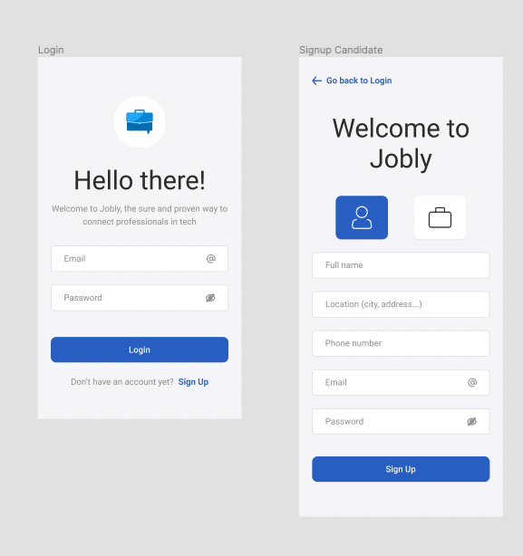
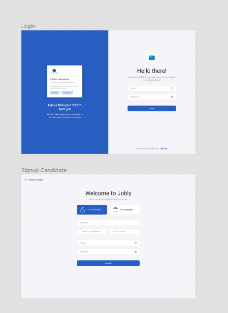
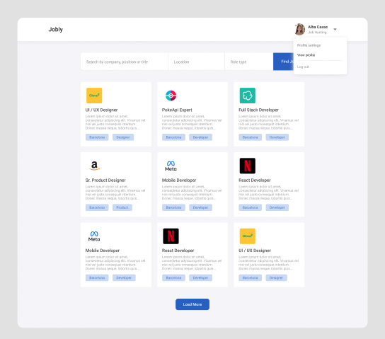
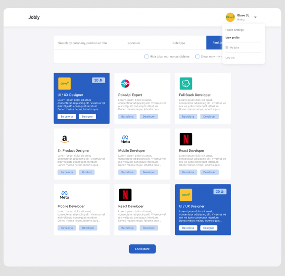
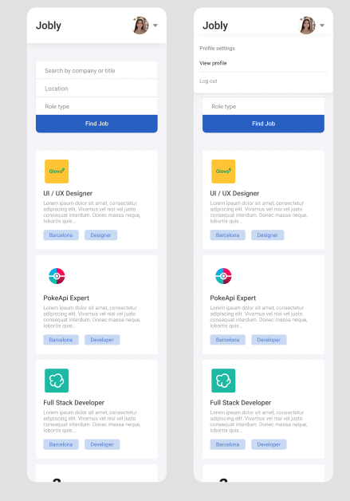
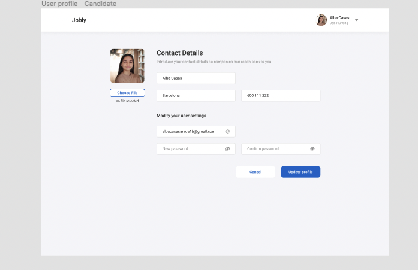
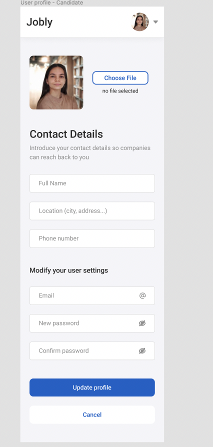
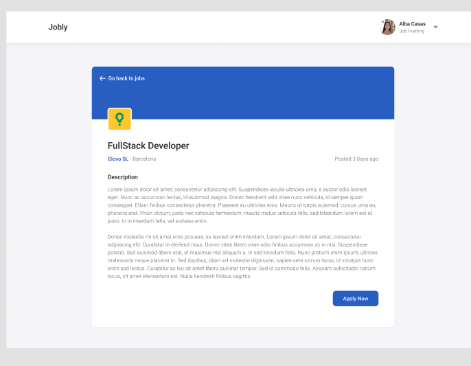
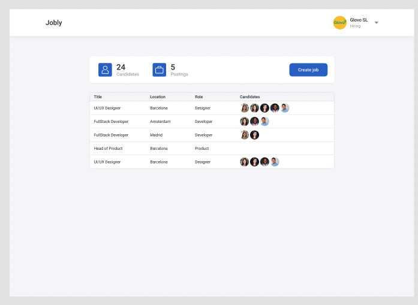
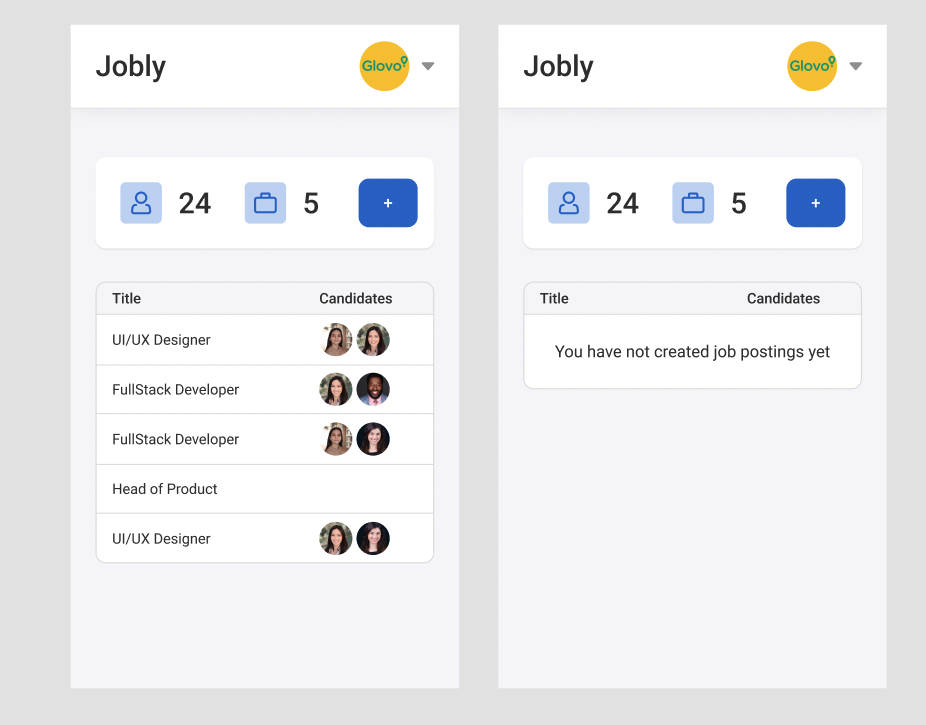

## Technical Description

### Blocks

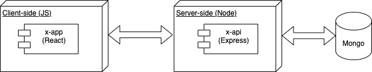

---

### Data Model

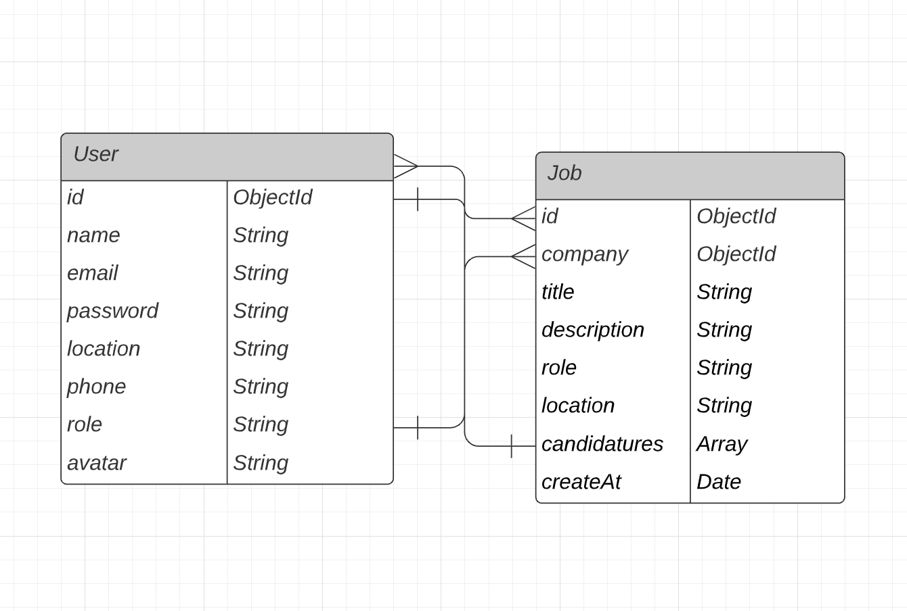

---

User

- email (string, required, unique)
- password (string, required, min length 8)
- location (String, required)
- phone (String, required)
- avatar (String)
- name (String, required)
- role (String, enum: ["company", "candidate"], required)

Jobs

- company (ObjectId, ref: "User", required)
- title (String, required)
- description (String, required)
- role (String, required, enum["designer", "developer", "product"]
- location (String, required)
- candidatures (Array)
  - candidate (ObjectId, ref: "User")
  - resume: String
  - createAt: (Date, required, dafault(Date now))
- createAt (Date, required, dafault(Date now))

## Tasks history

### Docs

- ~~TODO introduce the project, describe it (.5h)~~

#### Functional Description

- ~~TODO create use cases diagram (.25h)~~
- ~~TODO create wireframes in paper (2h)~~
- ~~TODO create wireframes in figma (alt excalidraw) (3h)~~
- ~~TODO create wireframes in README (images) (1h)~~

#### Technical Description

- ~~TODO create blocks diagram (.5h)~~

- ~~TODO create data model in paper (1h)~~
- ~~TODO create data model in diagrams.net (E/R) (1h)~~
- ~~TODO create data model in README (images) (1h)~~

### Data

- ~~TODO create mongoose schemas and models (2h)~~
- ~~TODO create populate.js to test my models (1h)~~

### App

- ~~TODO create main views (components) (1h)~~
- ~~TODO mechanize navigations (.5h)~~
